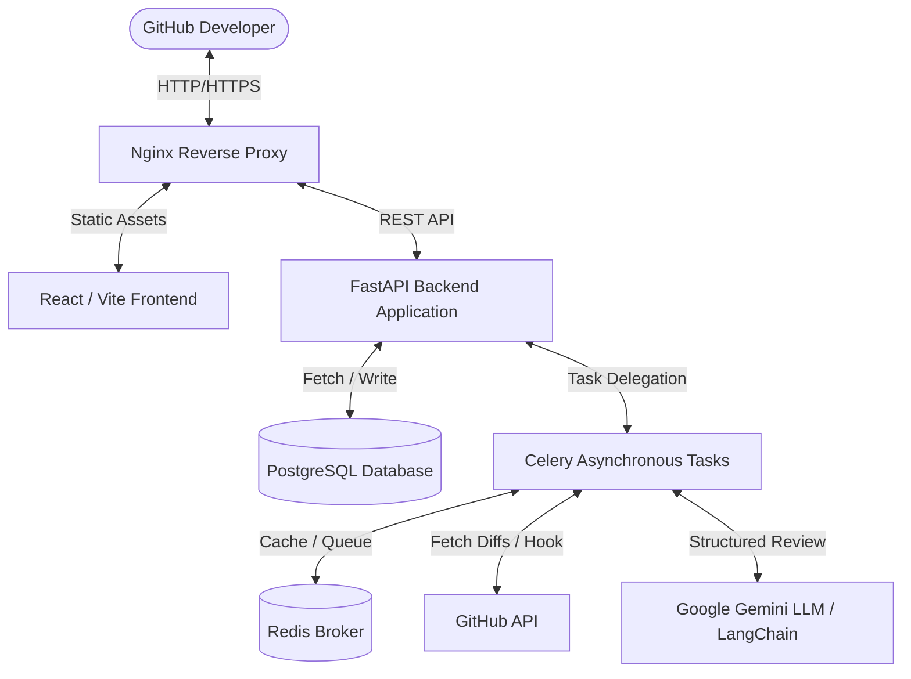

# CodePilot AI

[](https://opensource.org/licenses/MIT)
[](https://fastapi.tiangolo.com)
[](https://react.dev)
[](https://deepmind.google/technologies/gemini/)

> **AI-powered Pull Request Review Platform for GitHub.** Automate security audits, code reviews, and developer workflow insights with Google Gemini.

CodePilot AI is a production-ready, open-source platform that automatically scans pull request diffs, provides inline code recommendations, facilitates interactive contextual developer chats, and provides deep repository analytics.

---

## 🏗️ Architecture System Diagram



---

## ✨ Features

- **Automated Pull Request Reviews**: Scans files, parses unified diff line changes, and places structured review comments (severity levels: `info`, `warning`, `error`, `critical`).
- **Interactive Inline Suggestions**: Accepts/rejects suggested improvements directly in a side-by-side or unified code reviewer view.
- **PR Contextual Copilot Chat**: Each PR gets a dedicated AI discussion context to explain code blocks or identify memory leaks.
- **AI Generator Tools**: Instantly creates unit tests (`pytest`, `jest`, `junit`) or Markdown documentation based on changed files.
- **Repository Insights**: Calculates repository complexity, duplicate lines, dead files list, and technical debt hours.
- **Developer Sandbox Mode**: Full developer staging mode bypasses GitHub keys to enable instant mock review demonstrations.

---

## 📁 Folder Structure

```text
codepilot-ai/
├── docker-compose.yml       # Docker orchestration configs
├── nginx.conf               # Root proxy routing configs
├── backend/
│   ├── Dockerfile           # Multi-stage image build
│   ├── requirements.txt     # Python dependency mapping
│   ├── alembic.ini          # DB migrations configuration
│   └── app/
│       ├── main.py          # FastAPI application entrypoint
│       ├── api/             # Routes for auth, repos, reviews, and AI
│       ├── core/            # Configs, security helper, and token managers
│       ├── database/        # Engine & Session loaders
│       ├── models/          # Declarative SQLAlchemy models
│       ├── schemas/         # Pydantic schemas
│       ├── services/        # GitHub API & Gemini wrappers
│       └── workers/         # Celery tasks & brokers
└── frontend/
    ├── Dockerfile           # Multi-stage node/nginx image build
    ├── package.json         # Node packaging configurations
    ├── vite.config.ts       # Vite compiler configurations
    ├── tailwind.config.js   # Style configurations
    ├── index.html           # Main SPA HTML structure
    └── src/
        ├── main.tsx         # React compiler entry
        ├── App.tsx          # Router and providers setup
        ├── index.css        # Stylesheet & color tokens
        ├── components/      # Sidebar, Navbar, and Diff viewers
        ├── layouts/         # Layout routers
        ├── pages/           # Dashboard, Reviews, and Insights screens
        ├── services/        # API fetch clients
        └── store/           # Zustand global state managers
```

---

## ⚙️ Environment Variables

### Backend Configuration (`backend/.env`)

```env
# GitHub OAuth Credentials
GITHUB_CLIENT_ID=your_github_client_id
GITHUB_CLIENT_SECRET=your_github_client_secret

# Deployment URL References
BACKEND_URL=https://codepilot-backend.onrender.com
FRONTEND_URL=https://codepilot-ai-sigma-woad.vercel.app

# Google Gemini AI Key
GEMINI_API_KEY=your_gemini_api_key

# Database Connection (FastAPI auto-creates tables)
DATABASE_URL=postgresql://codepilot_user:codepilot_password@db:5432/codepilot
```

### Frontend Configuration (`frontend/.env`)

```env
VITE_API_URL=https://codepilot-backend.onrender.com
```

---

## 🚀 Installation & Local Development

Launch the entire stack (PostgreSQL, Redis, Celery, FastAPI, React SPA, and Nginx) with a single command:

```bash
# 1. Clone the repository
git clone https://github.com/developer/codepilot-ai.git
cd codepilot-ai

# 2. Build and start containers
docker-compose up --build
```

The application is served at **`http://localhost`** (routed via Nginx proxy).

- **Frontend Application**: `http://localhost/`
- **FastAPI OpenAPI Documentation**: `http://localhost/api/docs`

---

## 🛡️ License

Distributed under the MIT License. See [LICENSE](LICENSE) for details.
